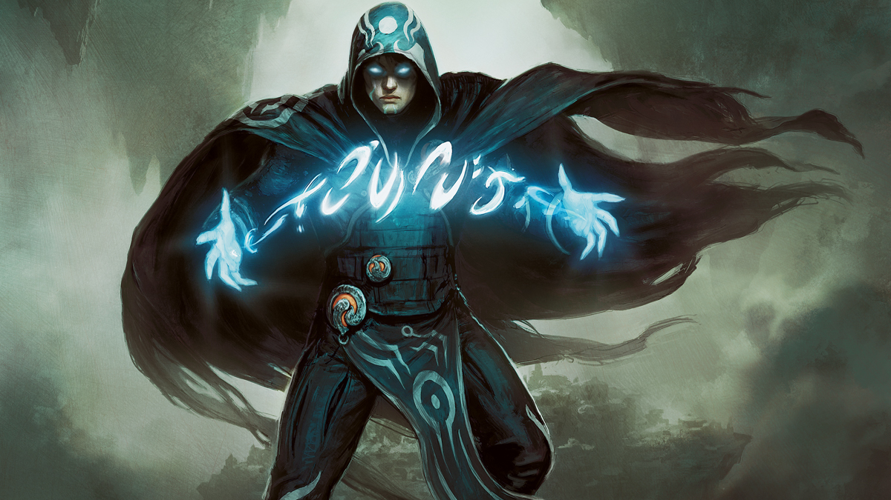

## Overview

Magic the Gathering is the most popular trading card game in the world, first published by Wizards of the Coast in 1993. There are various formats in competitive play with large cash prize pools for professional tournaments. Decks can run anywhere between $600 and $3000. The main problem with Magic is if you want to try out a competitive deck, you have to purchase it. There is an online Magic program (MTGO) that people can use to practice playing, but you have to purchase the card packs on there as well! This is really damaging to Magic players' wallets because there is no way to practice using decks for free. You have to pay hundreds or even thousands of dollars no matter what. This is especially terrible for all of the UH students that have to pay to test out decks because, as we all know, college students are nearly destitute as a whole. This lack of Magic resources for students sucks for avid, and poor, players of this incredibly expensive game. That's where we come in. We'd like to create a program similar to MTGO, where UH students can construct their decks and play against each other for practice, and it'll be entirely free!

We'll also make our app UH Manoa specific. Not only will it be exclusive to the UH students, we will replace the art and flavor text of the cards to fit it to UH Manoa. The "land" cards will be locations around campus, and other cards will be of staples and artwork on UH. The flavor text of each card (the text on the bottom that tells a story or has dialogue about what the card represents in the Magic lore) can lay out UH Manoa's "lore".

## Mockup page ideas

The app will basically have a matchmaking and chat home screen, as well as a deck building page. The meat of the app will be in the actual Magic game playing page. It will simulate the game battlefield and update in real-time as the players make their moves. The game itself won't have an AI or rules structure. It's meant for people that know how to play Magic, as just like in real life, they can do whatever they want and it's up to the other player to catch them misplaying or even cheating. However, there will be a rules cheat sheet for reference, and an in-game chat. The game will be phase-based, so each turn will have the steps of the game (untap, upkeep, draw, main phase 1, attack declaration, block declaration, damage, main phase 2, and the end step) so the player can do whatever moves they want and undo until they lock in their move for the step. In the case of cheating or abusive behavior however, there will be a report button, and if a person gets reported enough, their account and IP address will be banned.

## Use case ideas

People could use our web app by accessing it on its site, which would be hosted on our allocated UH ITS server space. After logging in using their UH account, they will have access to their saved decks and the ability to play with a friend or be randomly matched with other online players. A lot of UH students play Magic, so having a solid playerbase shouldn't be a problem.

## Beyond the basics

Initially, our app will only have a couple of decks to play, since data entry will be time consuming and there are approximately 15000 total cards. However, we will eventually try to integrate more cards and even pre-made Standard meta decks, depending on which cards are in the current Standard format rotation. Once we have more cards available, we would have the different formats for players to select and maybe even randomly challenge other players online in that format, in which the unavailable cards will be banned and not allowed in the decks. We could also have data lookup, where players can view the decks that are currently in the meta (the decks professional players use in tournaments).
