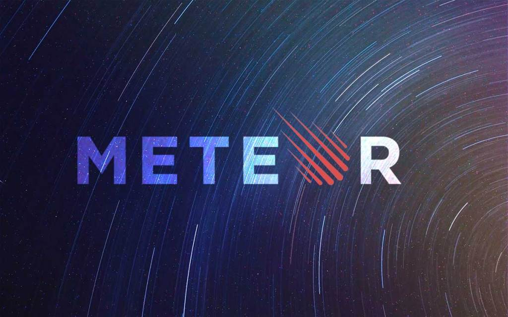

Meteor is an interesting web application framework. It's powerful, and I really like the client/server interactions with Mongo databases as well as the instant updates. However, I don't like the initial difficulty. There was a lot to learn about Meteor, and the way we "learned" it was definitely not effective. Rather than actually learning about the concepts traditionally before application, it was mostly following tutorials, and the only concept instruction was related to the databases, which weren't that clear either. Following the tutorials and learning purely through application does not teach the concepts at all, and only teaches you to use it, and not fully understand everything, which makes problem solving unnecessarily difficult. There weren't any particular concepts that I found difficult, it was more of a general learning curve in using Meteor effectively and efficiently. However, if I had to pick something, it would have to be understanding the mongo and minimongo database collections. I feel that I have a solid understanding of how they work now, but at first, it wasn't easy grasping the general concept and understanding how they sustain through the client and/or server, especially with the built-in functions since I didn't really learn what they were intuitively.

When I first started using Meteor, I thought the ECMAScript 6 file structure was incredibly easy and intuitive to understand, and actually much easier to use than the previous ES5 file structure of having all of the JS files in one directory. The organization made the process of app building much more fluid. Also, I found the integration between HTML, CSS, and JS files easy due to the intuitive event handling and importing. I thought the most interesting thing about Meteor is the fact that it has real-time, instantaneous updates whenever you save your code. This makes things _really_ easy to test, as I don't have to wait forever building Meteor every single time I make an update to my code or want to test something out. Props to the Meteor Development Group for that!

My first impressions of Meteor as an application architecture are that it's _awesome_! As I just stated, the instant updates are the coolest thing ever and really enhance programming efficiency and speed. Also, it really simplifies the process of making web apps, as I don't have to deal with making my own SQL databases since the MongoDB collections are right there and easy to use and alter. The package system is also handy, as within just a few keystrokes, I can add really cool features to my app without having to spend a long time coding out the groundwork myself. Overall, I like Meteor and its usefulness in web application development, it would just be better if there were more useful resources to actually learning about _how_ it works, rather than just applying concepts through tutorials.
