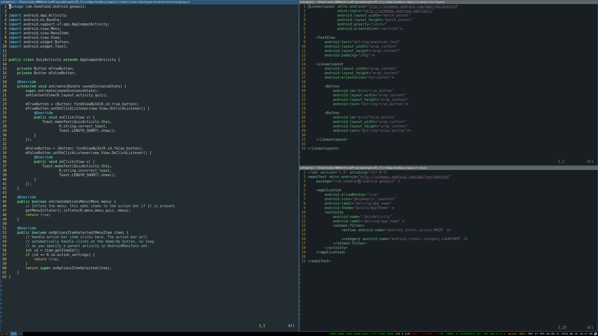

  

GeoQuiz is a simple Android app that uses textviews, buttons, toasts, and menus to present a question about geography to the user. The user answers the question by pressing a "True" or "False" button and a toast appears indicating if they were correct or not. They must press another button to view the next question. While this app may seem simple, coding it definitely wasn't. I used the Android Studio IDE with Java and XML to create the app. Android Studio isn't easy to use, and requires intermediate to advanced Java and XML knowledge, as well as knowledge on the Android API and how apps work.

I made this app in preparation for an Android App Development course I taught at Punahou School. My role was one of the two instructors, and both of us collaborated on the preparation. However, I made the GeoQuiz app on my own while she made the slides and prepped what would happen during class for the beginning. Punahou contracted DevLeague to teach a few classes for their summer school. Our class was designed for high school students, and we used this app as a skeleton for the students to use Android Studio and design their own app for Android.

I definitely learned quite a bit from this project. Android Studio is surprisingly difficult and having the experience of using it, even briefly for such a simple project, makes me feel more confident in my ability to make apps in the future. Mobile app development is booming in the programming business, and the knowledge of the IDE is incredibly important, especially with app-specific funcitonalities that this project required me to use, including toasts, buttons, textviews, and layouts. I also learned a few things about Java, such as anonymous & local inner classes and event listeners. The interaction with XML was another new thing for me, as I had never worked with markup languages prior to this app.

[Here is my source code for GeoQuiz.](https://github.com/JHeadland/GeoQuizAndroidApp) It's uploaded at a tar.gz archive because GitHub wouldn't let me upload the source files individually (it was too big).
