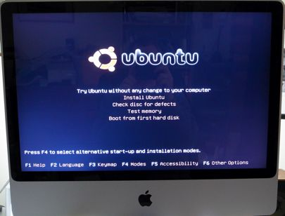

I work for the junior side of DevLeague, a coding bootcamp, Junior DevLeague. Junior DevLeague recently opened up an Academy, and I teach a GNU/Linux + Python networking class every Saturday to middle to high school students with my co-worker, [Irene Fang](https://irene-f.github.io/). Our Academy space only has the latest iMacs available, and we wanted to run GNU/Linux on the computers for the students to interact with the OS. We attempted to load Debian on the iMacs, but that was nigh impossible as the Apple hardware is really only compatible with Apple software.

I learned a lot about Mac OS X from this. Before, I had minimal exposure due to my dislike of Apple products, and having to dual-boot another OS on iMacs furthers my dislike of it. Apple hardware & drivers are extremely proprietary to the point where nothing other than Apple software works on the iMac Intels. Without this project, I wouldn't have known about how OS X works in the base level with its boot loaders and BIOS.

We eventually succeeded in installing Ubuntu 16.04.1 LTS, and created a comprehensive guide on dual-booting it on the iMacs alongside OS X using the rEFInd boot menu. [Here is the installation guide we wrote.](https://docs.google.com/document/d/1w4PWbVEAnQigRdpTpKcBaXpEsLkMOYWQBlq4wS1noHU/edit?usp=sharing)
